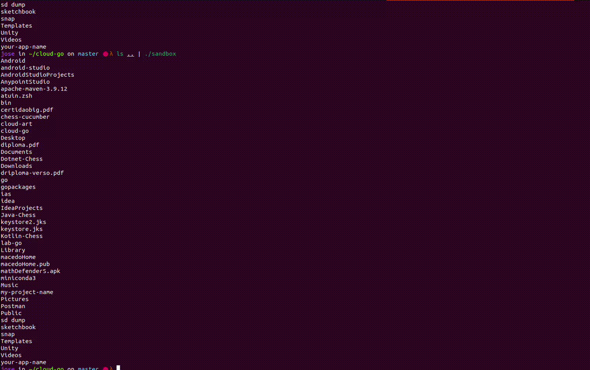

# 🛠️ Sandbox Transformer

A high-performance terminal middleware to inject ASCII art, cheat sheets, and animations into your command-line output.



## 🚀 How it Works

`sandbox` is designed to live in the middle or at the end of your UNIX pipes. It captures the output of your commands, processes it through an engine of transformers and sleepers, and renders it with style.

### Instalation

You can download it from the releases or compile with `go build sandbox.go`. Important is that the binary is at yout PATH.

### Usage

Inject it into any pipe:
```bash
# In the middle of a pipe
ls -la | sandbox | less

# At the end of a pipe
cat large_file.txt | sandbox
```

It comes without any ascii art load. Use the following command to load ascii arts

```bash
sandbox add path/to/your/art.txt
```

E.g.

```bash
sandbox add samples/cloud
```
